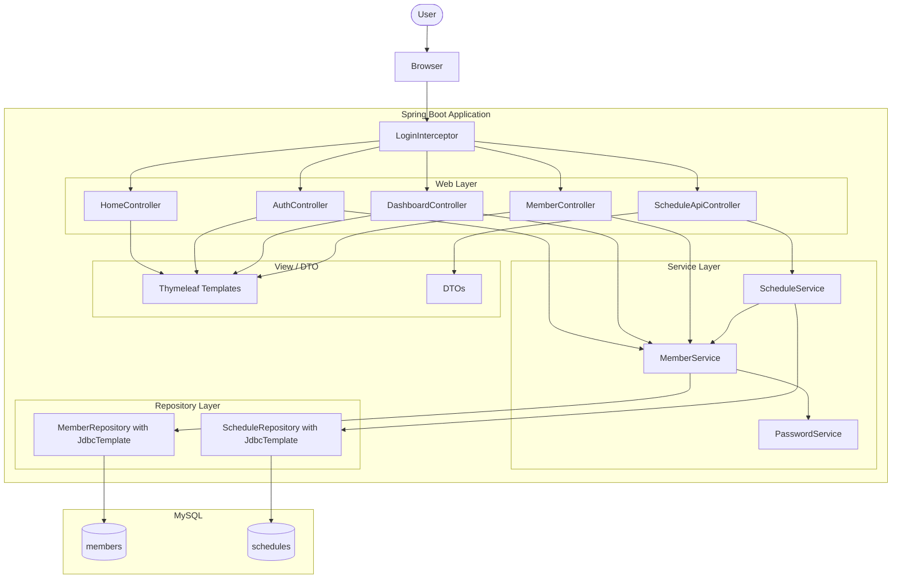
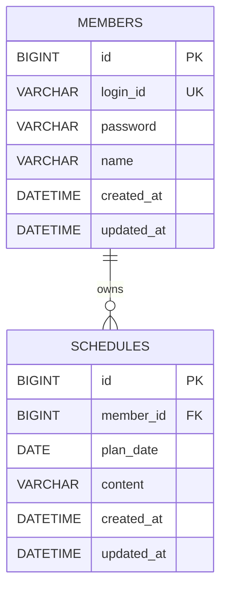
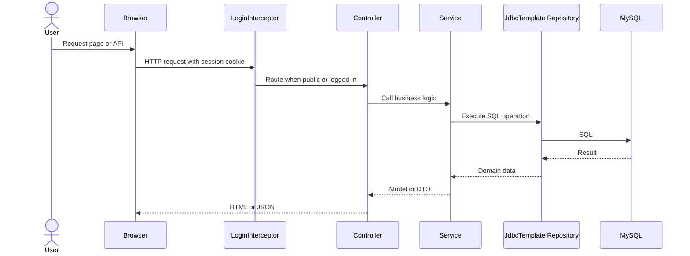

# Member Site Diagram

## Architecture

```mermaid
flowchart TB
    user([User])
    browser[Browser]

    subgraph app[Spring Boot Application]
        interceptor[LoginInterceptor]

        subgraph web[Web Layer]
            home[HomeController]
            auth[AuthController]
            dash[DashboardController]
            memberCtl[MemberController]
            scheduleApi[ScheduleApiController]
        end

        subgraph service[Service Layer]
            memberSvc[MemberService]
            scheduleSvc[ScheduleService]
            passwordSvc[PasswordService]
        end

        subgraph repo[Repository Layer]
            memberRepo[MemberRepository with JdbcTemplate]
            scheduleRepo[ScheduleRepository with JdbcTemplate]
        end

        subgraph view[View / DTO]
            thymeleaf[Thymeleaf Templates]
            dto[DTOs]
        end
    end

    subgraph db[MySQL]
        members[(members)]
        schedules[(schedules)]
    end

    user --> browser
    browser --> interceptor
    interceptor --> home
    interceptor --> auth
    interceptor --> dash
    interceptor --> memberCtl
    interceptor --> scheduleApi

    home --> thymeleaf
    auth --> memberSvc
    auth --> thymeleaf
    dash --> memberSvc
    dash --> thymeleaf
    memberCtl --> memberSvc
    memberCtl --> thymeleaf
    scheduleApi --> scheduleSvc
    scheduleApi --> dto

    memberSvc --> passwordSvc
    memberSvc --> memberRepo
    scheduleSvc --> memberSvc
    scheduleSvc --> scheduleRepo

    memberRepo --> members
    scheduleRepo --> schedules
```

## Domain ERD

```mermaid
erDiagram
    MEMBERS ||--o{ SCHEDULES : owns

    MEMBERS {
        BIGINT id PK
        VARCHAR login_id UK
        VARCHAR password
        VARCHAR name
        DATETIME created_at
        DATETIME updated_at
    }

    SCHEDULES {
        BIGINT id PK
        BIGINT member_id FK
        DATE plan_date
        VARCHAR content
        DATETIME created_at
        DATETIME updated_at
    }
```

## Main Request Flow

```mermaid
sequenceDiagram
    actor U as User
    participant B as Browser
    participant I as LoginInterceptor
    participant C as Controller
    participant SV as Service
    participant R as JdbcTemplate Repository
    participant D as MySQL

    U->>B: Request page or API
    B->>I: HTTP request with session cookie
    I->>C: Route when public or logged in
    C->>SV: Call business logic
    SV->>R: Execute SQL operation
    R->>D: SQL
    D-->>R: Result
    R-->>SV: Domain data
    SV-->>C: Model or DTO
    C-->>B: HTML or JSON
```
